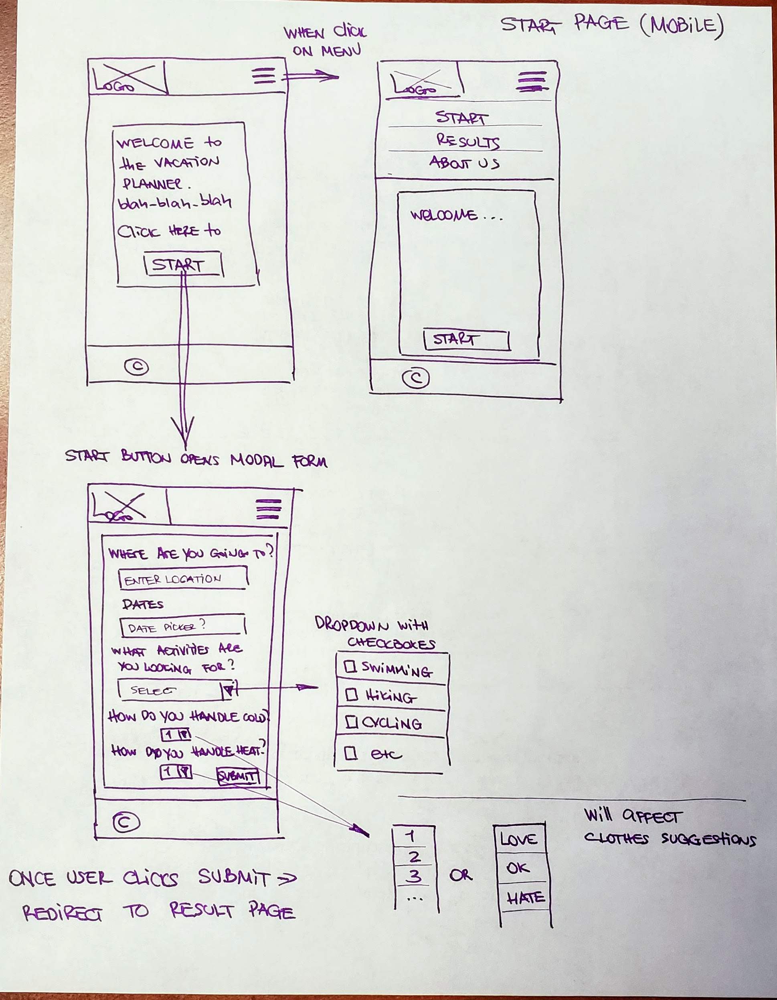
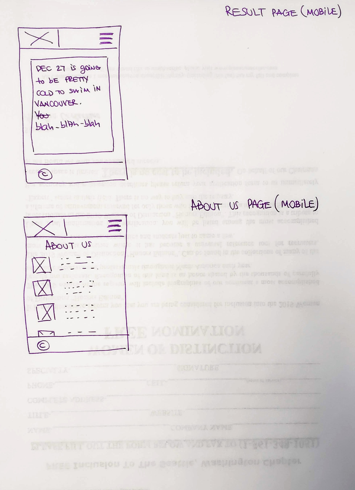
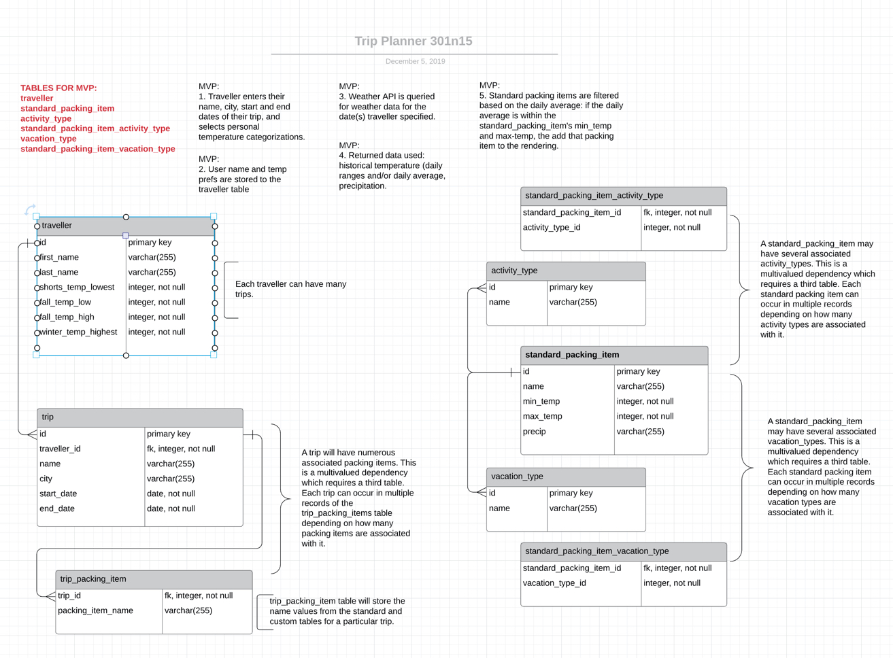

# Vacation-Planner (301-n15 Final Project)

## Team members:
  - Diana Kim
  - Ehsan Ghafari
  - Leo Kukharau
  - Tammy Ip

## Project Description:
  ### Deployed app link:
  https://cf301n15-final.herokuapp.com/

  ### MVP wireframe:

   
  

## Problem Domain:
  ### MVP Problem Domain
  User needs an quick, convenient way to customize a packing list for their trip.

## Versions:

  1.0.0 - MVP

## Libraries, Frameworks, Dependencies:
  ### Node.js Dependencies:   
  bcrypt: 3.0.7,  
  cors: 2.8.5,  
  dotenv: 8.2.0,  
  ejs: 3.0.1,  
  express: 4.17.1,  
  express-flash: 0.0.2,  
  express-session: 1.17.0,  
  method-override: 3.0.0, 
  passport: 0.4.0,  
  passport-local: 1.0.0,  
  pg: 7.14.0,  
  superagent: 5.1.2  

## Instructions:
  ### Environmental variables:
  PORT  
  DATABASE_URL - postgreSQL url  
  GEOCODE_API_KEY - google API key  
  WEATHER_API - Dark Sky API key  

## Sample endpoints:

## Database Entity Relationship Diagram:
  ### Created on lucidchart.com
   

## Credits and Collaborations  
[Icons](https://icons8.com/)
